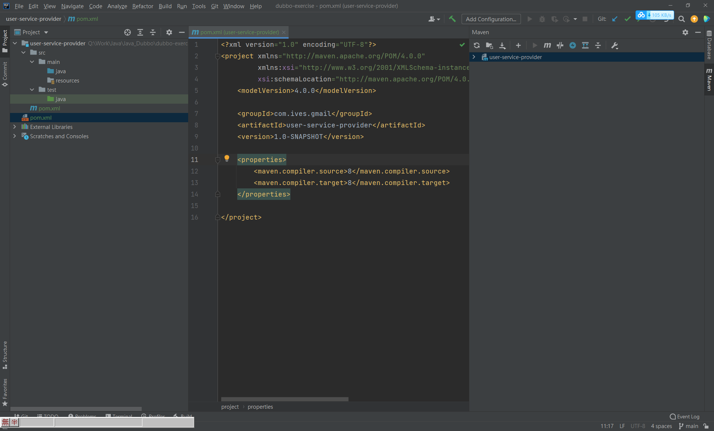

# Java Dubbo

Dubbo筆記

# Dubbo 官網

有中文的簡介及架構介紹

https://dubbo.apache.org/zh/docs/v2.7/user/preface/background/


GitHub

https://github.com/apache/dubbo

# RPC

RPC(Remote Procedure Call)是指遠程進程調用，是一種進程通信方式。

RCC有兩個核心模塊：通訊、序列化。

RPC框架有很多如：

- dubbo
- gRPC
- Thrift
- HSF

# 使用ZooKeeper當註冊中心

安裝及使用參考這篇文檔

https://github.com/IvesShe/Java_ZooKeeper


# Dubbo Admin

https://github.com/apache/dubbo-admin/tree/master


## 修改zookeepe位址

zookeeper://35.229.195.168:2181，圖片的地址打錯了


## 使用maven打個jar包

```bash
mvn clean package

```


得到jar包


## 運行jar包

```bash
java -jar dubbo-admin-0.0.1-SNAPSHOT.jar
```

成功運行在7001端口


## 訪問

localhost:7001

預設帳號密碼都是root

成功訪問


(如果服務器沒反應，可在cmd視窗按ctrl+c試)

從zookeeper查看，也多了一個dubbo的節點


# 創建新專案 及模塊


創建模塊user-service-provider，GroupID是com.ives.gmall，圖中打錯


創建完成



創建order-service-consumer


再創建gmall-interface


共用的接口及bean放在gmall-interface


# ZooKeeper配置

參考

https://dubbo.apache.org/zh/docs/v2.7/user/configuration/config-center/


# Dubbo查看

運行寫好的代碼，查看Dubbo

運行提供者


新增消費者


# dubbo-monitor-simple

簡單的監控中心

在之前捉的文件裡


## 修改zookeepe位址


## 打個jar包

```bash
mvn clean package
```


解壓縮這個資料夾


運行目錄裡的start.bat


# 訪問監控中心

http://localhost:8080/


# 配置監控中心

可參考

https://dubbo.apache.org/zh/docs/v2.7/user/simple-monitor/


設置好配置檔，重新運行後，成功查看到服務了


